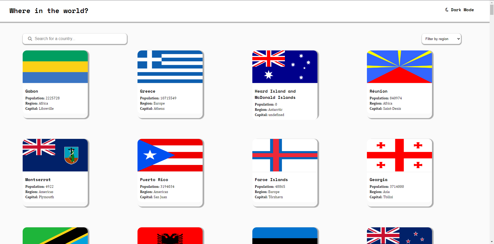
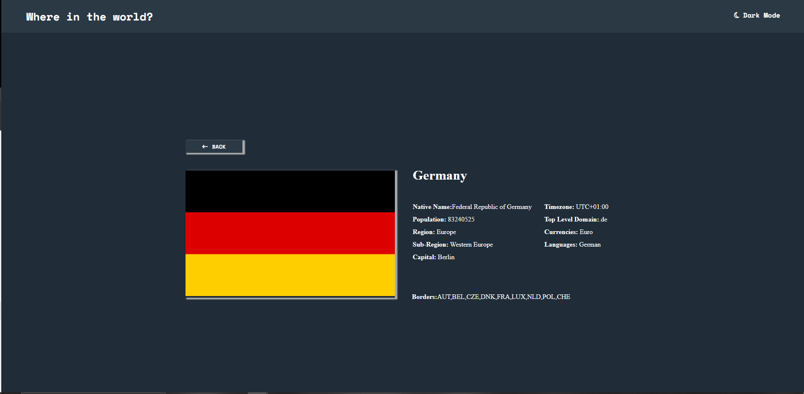

# Rest Countries API

This project was developed with HTML, CSS and Javascript. It is a list of countries that is displayed and the user can filter the countries, with both the search field and the select by continent.

## Deploy

🚀 https://matheusfribeiro.github.io/rest-countries-api/

## Author

- [@matheusfribeiro](https://github.com/matheusfribeiro)

## Colors

| Color               | Hexadecimal                                                |
| ----------------- | ------------------------------------------------------------------ |
| White      |  #fafafa   |
| Dark Blue      |  #202c37   |
| Very Dark Blue      |  #2b3945   |

## Screenshots

